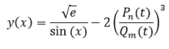

# Вычисление значений функций

## Задание
Написать программу, вычисляющия значения выражения. Значения функций, входящих в выражение, найти с помощью соответствующих вычислительных алгоритмов. Погрешность вычисления каждой функции 10 -8 . 

## Вид функции

## Готовая программа

### <strong>Вычисление значения многочлена производится по схеме Горнера</strong>  

### Начальное окно

 

### Создание многочлена (числитель)
.png)

 

### Создание многочлена (знаменатель)
.png)

 

### Результат

 

### Проверка результата
https://planetcalc.ru/2787/  
