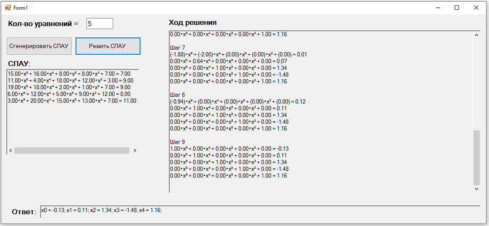

# Вычислительные методы решения систем линейных алгебраических уравнений

## Задание
1. СЛАУ имеет порядок n≥10. Коэффициенты и свободные члены системы – случайные числа из интервала (a, b) 
2.	Написать программу, реализующую алгоритм нахождения решения СЛАУ методом Гаусса. Программа должна выдавать результаты вычислений (расширенную матрицу системы) на каждом шаге

## Готовая программа

## Проверка решения
