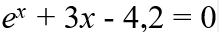
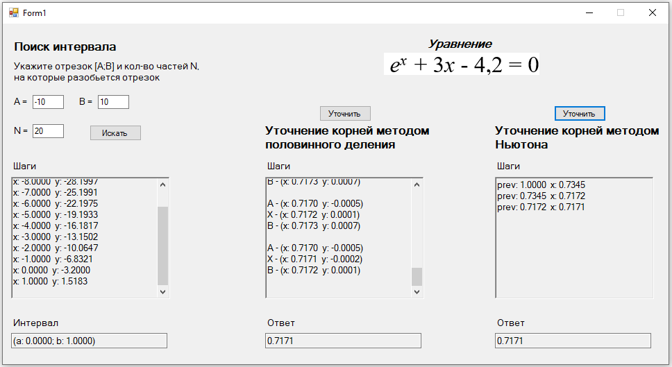

# Решение нелинейных уравнений

## Задание
Написать программу решения нелинейного уравнения, которая:

## Уравнение

1.	Отделяет корни уравнения алгебраическим способом
2.	Уточняет корни уравнения методом половинного деления с точноcтью e = 0,0001.
3.	Уточняет корни уравнения методом Ньютона с точноcтью e = 0,0001.  

Результаты решения на каждой итерации представить в виде таблицы

## Готовая программа
